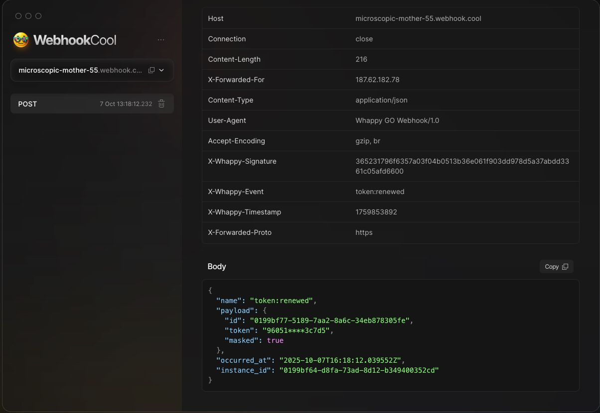

# 📝 Changelog
All notable changes to this project will be documented in this file.

The format is based on [Keep a Changelog](https://keepachangelog.com/en/1.0.0/),
and this project adheres to [Semantic Versioning](https://semver.org/).

---

## [0.2.0] - 2025-10-07 
 
### 🚀 Added 
- ✨ **Instance Webhooks Support** 
	- 🌐 **Instance Webhooks** — instances can now receive event notifications via registered webhook URLs. 
	- 🔐 **Secure Signatures** — each webhook request is signed using HMAC-SHA256 for validation on the receiver’s side. 
	- ⚙️ **Webhook Management API** — full CRUD support: 
		- GET `/webhooks` — list all webhooks for the authenticated instance 
		- POST `/webhooks` — create new webhooks 
		- GET `/webhooks/{id}` — retrieve a specific webhook 
		- PUT `/webhooks/{id}` — update existing webhooks 
		- DELETE `/webhooks/{id}` — delete webhooks 
	- 🧪 Unit tests for webhooks and event dispatching added. 
	- ⚠️ Custom Webhook Errors — introduced typed errors for webhook failures. 
	
  

## [0.1.0] - 2025-10-05
### 🎉 Initial Release
- 🚀 **HTTP Endpoints for WhatsApp** — simple REST API for message automation
- 🔐 **Multi-instance Authentication** — manage multiple WhatsApp sessions via QR Code
- 💬 **Messaging Support** — send text, images, documents, audio, and more
- 👥 **Group & Contact Management** — create, update, and manage groups and contacts
- ⚡ **High-performance Core** — fast and efficient HTTP handling with Fiber
- 🗄️ **Database Support** — sqlite and postgres integration
- 📦 **Storage & Uploads** — global media storage and user uploads
- 🕋 **Cache Layer** — in-memory or Redis caching
- 🧩 **Flexible Authentication** — instance tokens or admin impersonation
- 📝 **Beautiful Documentation** — clear API reference and web interface
- 🛠 **Event Bus System** — central event hub with flexible Pub/Sub drivers

[0.1.0]: https://github.com/mauriciorobertodev/whappy-go/releases/tag/v0.1.0
[0.2.0]: https://github.com/mauriciorobertodev/whappy-go/releases/tag/v0.2.0